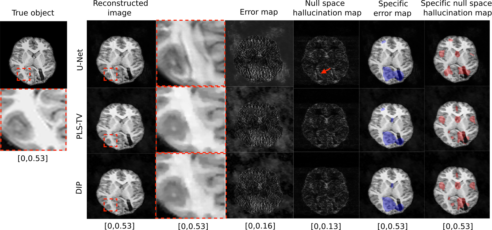

Tomographic image reconstruction is generally an ill-posed linear inverse problem. Such ill-posed inverse problems are typically regularized using prior knowledge of the soughtafter object property. Recently, deep neural networks have been actively investigated for regularizing image reconstruction problems by learning a prior for the object properties from training images. However, an analysis of the prior information learned by these deep networks and their ability to generalize to data that may lie outside the training distribution is still being explored. An inaccurate prior might lead to false structures being hallucinated in the reconstructed image and that is a cause for serious concern in medical imaging. In this work, we propose to illustrate the effect of the prior imposed by a reconstruction method by decomposing the image estimate into generalized measurement and null components. The concept of a hallucination map is introduced for the general purpose of understanding the effect of the prior in regularized reconstruction methods. Numerical studies are conducted corresponding to a stylized tomographic imaging modality. The behavior of different reconstruction methods under the proposed formalism is discussed with the help of the numerical studies.

The figure above shows how hallucination maps can be used to identify false structures due to inaccuracies in the prior when employing a data-driven method (U-Net) for an out-of-distribution object. These false structures are absent in the non-data-driven reconstruction methods (PLS-TV and DIP).
